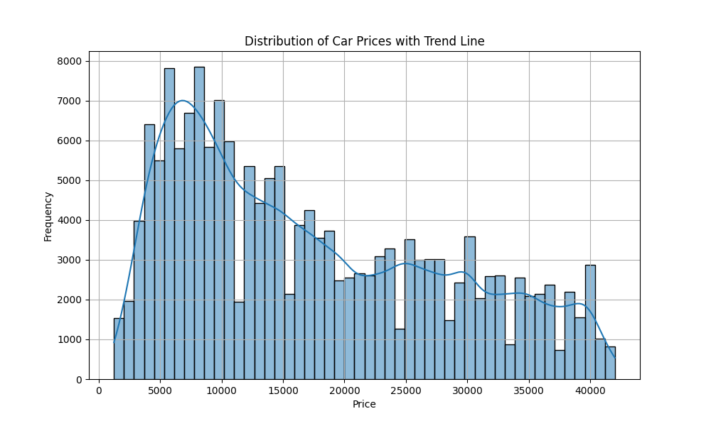

# Introduction
This project is an assignment for the AI/ ML certification course offered by UC Berkeley. In this project, I am analyzing used car data set with different models to answer the question "What drives the price of a car"

**Jupyter Notebook with code, experimentation, further insights, and deployment strategies: [here](https://github.com/mimibhatt/Price_Of_A_Car/blob/main/prompt_II_1.ipynb).**

**Website for this repo: [here](https://github.com/mimibhatt/Price_Of_A_Car).**

## Business Goal

The goal is to understand what factors make a car more or less expensive. This will give clear recommendations to a used car dealership as to what consumers value in a car. The goal of this analysis is to develop predictive models that can forecast price of a used car based on various vehicle features. This can help car dealers to understand what are the important features in a car and increase sales.

## Data

The data set is used car data of 426K rows and 17 columns. The dataset contains 4 numeric variables, 13 categorical variables and the target variable is the price of a car.

## Modeling and performance

In this project, we employed various regression modeling techniques to predict used car sale prices. The models evaluated include `Linear Regression`, `Ridge Regression`, `Lasso Regression`. Each model was trained and evaluated using a train/test split, followed by cross-validation and hyperparameter tuning using GridSearchCV to optimize performance. Due to the data set consisting of a large number of categorical variables, encoding them resulted in more than 11K columns, due to which training the set was a challenge. The cross validation, feature selection using SFS, hyperparameter tuning using GridSearchCV was not possible as the process ran for a long time.

Between Linear and Ridge Regression model, Ridge demonstrated the best performance with a `Root Mean Squared Error` (RMSE)  = 3832.3144, `R-squared` (R²) = 0.8751. That means that the model's prefictions are off by about 3832.3144 units from the actual values of price andapproximately 87.51% of the variance in the price as explained by the features in the model. 

The RMSE and R2 values indicate, the model can be improved significantly if we are able to figure out the important features and retrain the model.

<iframe src="https://vivianamarquez.com/Regression-Sklearn-Diabetes-Dataset/images/actual_vs_predicted.html" width="100%" height="600px"></iframe>

To see the interactive plot of actual vs. predicted values, please click the link below:
[Actual vs. Predicted Values](https://vivianamarquez.com/Regression-Sklearn-Diabetes-Dataset/images/actual_vs_predicted.png)

## Conclusions

Since I could not find the most important variables that affect the used car prices, I based my inference on the initial findings through plotting each feature against price. This does shed light on how each feature is correlated to the target variable price.

#### Interesting Findings

**Condition**: Prices generally decrease as the condition worsens, with new and like-new vehicles priced higher than those in fair or salvage condition.

**Drive**: Four-wheel drive vehicles command the highest prices, followed by front-wheel and rear-wheel drive vehicles.

**Type**: Pickup trucks and SUVs tend to have higher average prices, whereas hatchbacks, buses, and vans are priced lower on average.
Central Tendency: The median price is around $15,000

**Odometer**: Vehicles with lower mileage generally have higher prices, confirming that lower usage is associated with higher value

**Fuel Type**: Gas vehicles dominate the dataset. Diesel, hybrid, and electric vehicles are less common but show varied prices

**Transmission**: Automatic transmission is the most common, manual transmission vehicles tend to be lower-priced

**Year**: There is a clear trend of newer vehicles having higher prices, with older vehicles being significantly cheaper

**Cylinders**: There is a clear trend of increasing average vehicle price with the number of cylinders. This reflects the association of more cylinders with higher performance and luxury vehicles

**Manufacturer**: Luxury and high-performance brands such as Ferrari, Porsche, and Tesla command the highest average prices. Mainstream brands like Toyota and Ford have lower average prices, reflecting a broader market appeal and a mix of economy and mid-range vehicles

**Outliers**: There are significant outliers, as seen from the Actual versus Predicted plot, which may need further investigation.
Also the RMSE derived for Ridge and Linear regression are not particularly good and might benefit from feature selection

The disadvantage of this dataset was, due to a large number of categorical variables, it takes too long to train a model, do Grid search or feature selection.

### Actionable insights

- **Improve the model:** Filter the dataset to improve the speed of model training and increasing processing speed to determine the important predictors for price.

- **Improve inventory:** Based on the above findings, keeping inventory of cars with less odometer reading, gas vehicles preferably SUVs of manufactureres Toyota, Ford in a reasonably good condition will help increase the sale and fetch good prices.

 
